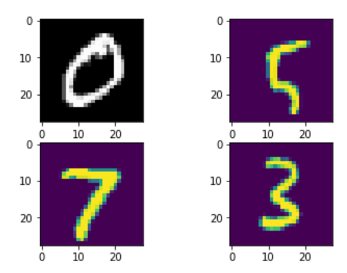

The MNIST database

Modified National Institute of Standards and Technology database or MNIST is handwritten digits dataset widely used for training various images in Deep Learning. It was created by "re-mixing" the samples from NIST's original datasets. The MNIST database contains 60,000 training images and 10,000 testing images. Half of the training set and half of the test set were taken from NIST's training dataset, while the other half of the training set and the other half of the test set were taken from NIST's testing dataset.

 

 

 
